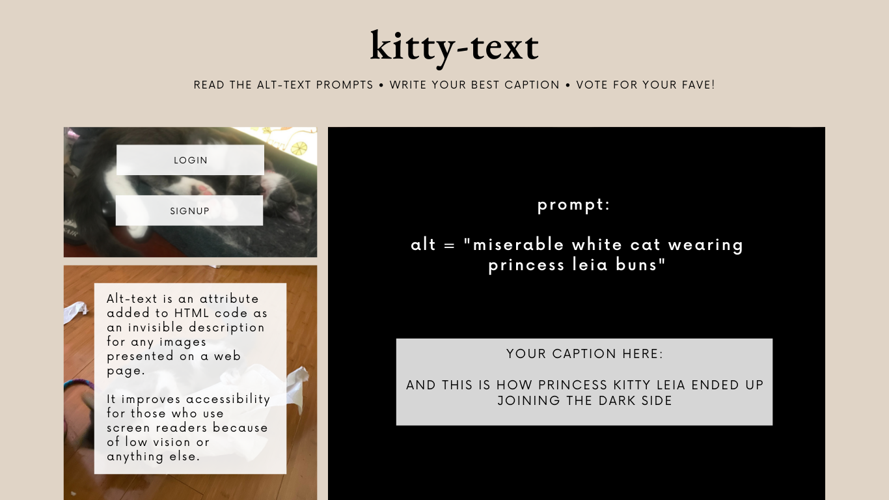
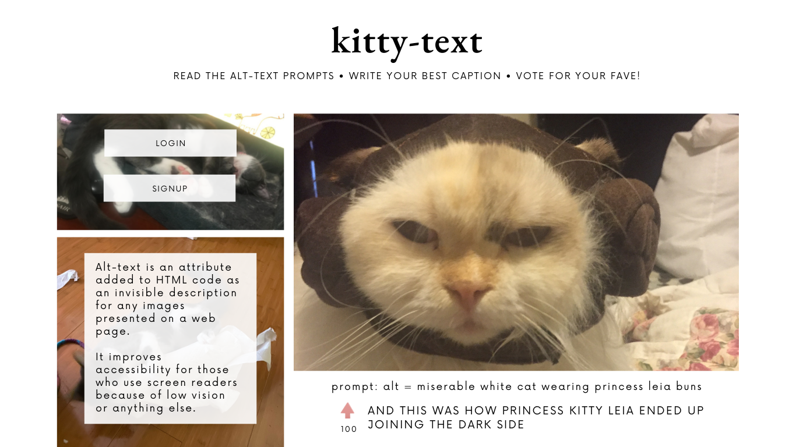
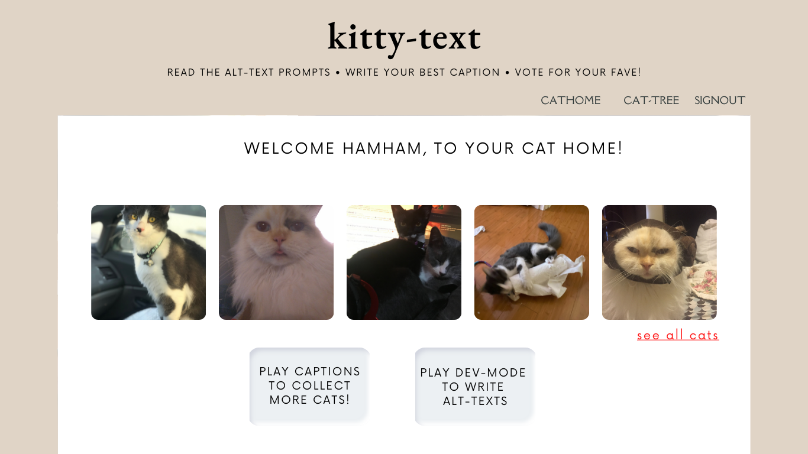
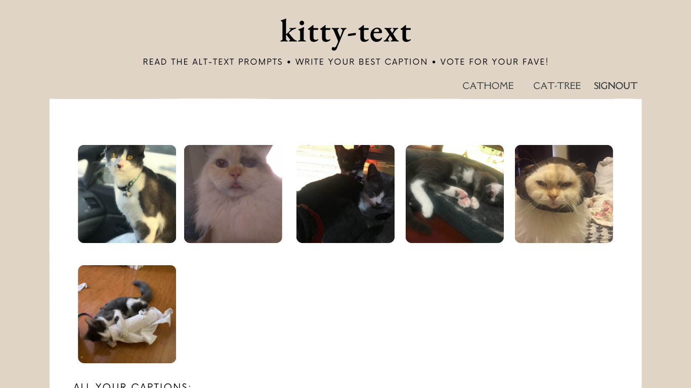
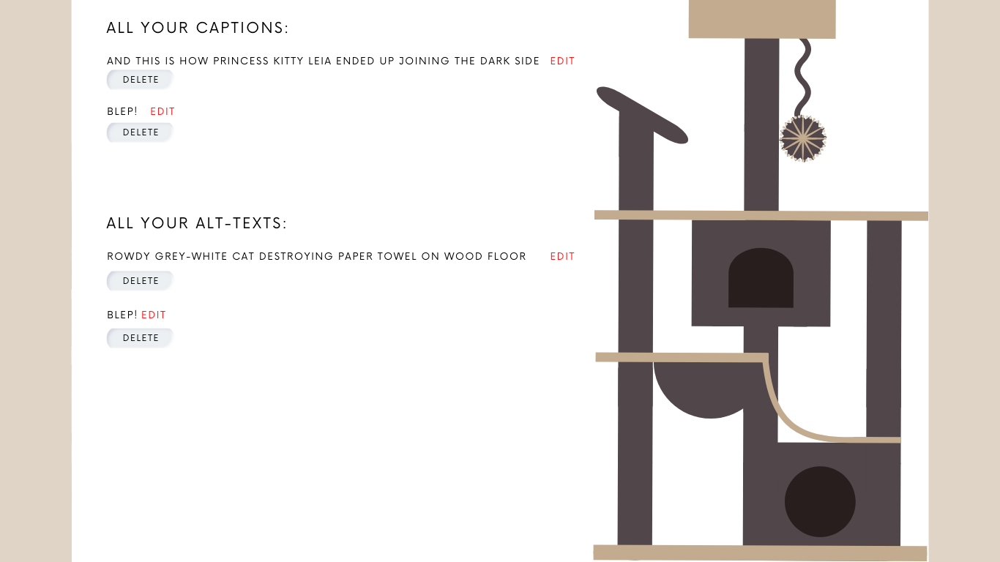
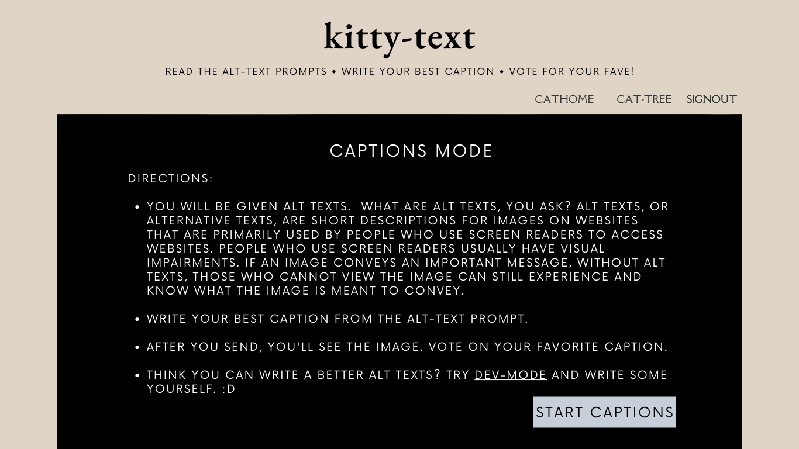
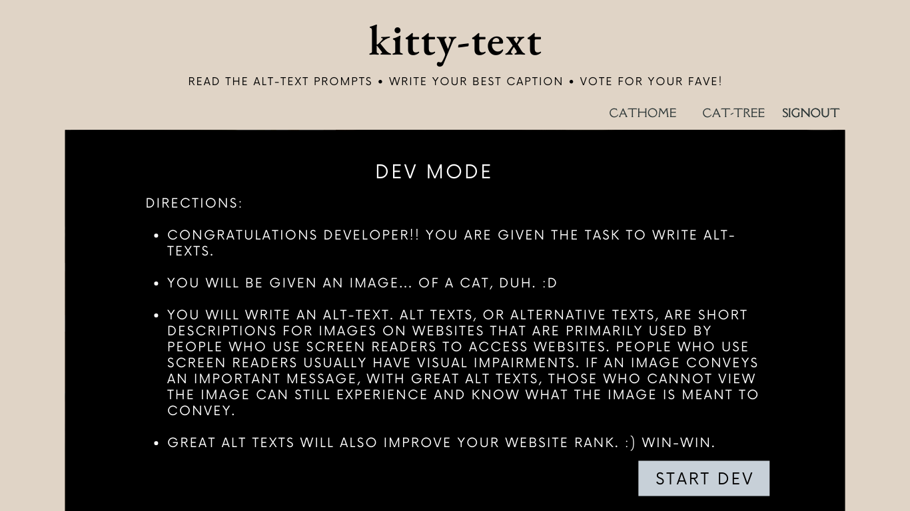
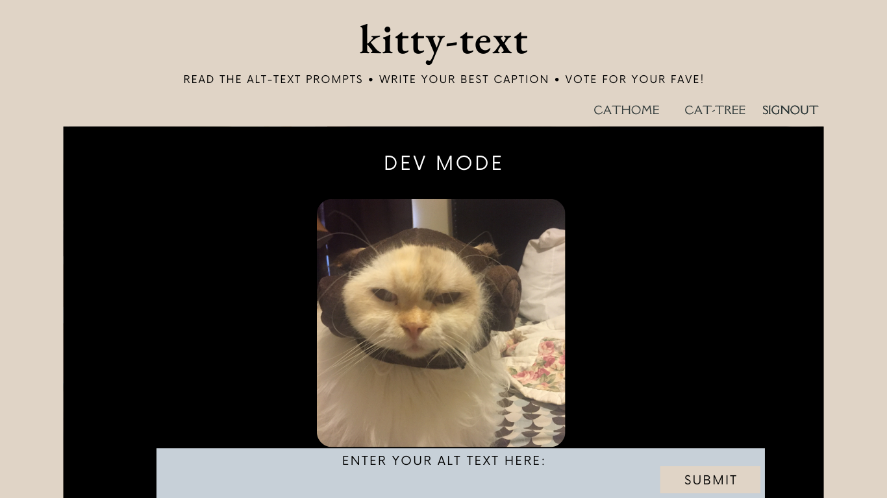

# kitty-text

## deployed here
https://kitty-text.herokuapp.com/

## project idea/description
What type of app would encourage people to once again, give up their personal email to try out?  I was suggested a cat rating app... like Rate-My-Chonk but it made me realize that I would be making another project that would exclude those who may be visually disabled or rely on assistive technology. This is my attempt to bridge that gap.  

It still involves ratings!  But instead of images, the user will be given prompts/[alt-texts] of cat images, and they will write a caption from just the prompt. Once entered, the actual image will show and users can vote on their favorite caption.  It's madlib sort of...with pictures... i don't know. :D

Users can continue to write captions or they can go "dev-mode" and write great alt-texts for other users.  ~~This might be a stretch goal.~~ DEFINITELY,is a stretch goal.

Hopefully, this will be entertaining to all participants including those using screen readers.

## User stories

- As a user, I want to vote my favorite captions.
- As a user, I want to look at my previous captions.
- As a user, I want to add captions.
- As a user, I want to delete captions.
- As a user, I want to view my previous captions.
- As a user, I want to see my profile page.
- As a user, I want to see all my captions in one page.
- As a user, I want to play devmode.(stretch goal) 
- As a user, I want to vote my favorite alt-texts.(stretch goal)
- As a user, I want to edit my alt-texts.(stretch goal) 
- As a user, I want to delete my alt texts.(stretch goal) 
- As a user, I want to view my previous alt-texts.(stretch goal) 
## MVP
- [x] use TheCatApi and write out 30-40 weak? alt-texts for images
- [x] keep track of all images users interact with captions
- [x] make sure user does not get the same prompt they have already captioned
- [x] functioning captions mode
- [x] upvote options for all captions
- [x] make sure user cannot vote on something more than once
- [x] delete/edit option for all captions in their cattree page
- [x] cats that were captioned on will become images in user's cattree

## stretch goals
- cats that were captioned on will become images in user's cattree, make them clickable
- random cat facts api on main page?
- dev affirmation api on "dev mode"
- about page
- if anything is edited, the vote count resets
- make a dev mode
## installation instructions

## link to deployed live site

## ERDS

## approach taken
## flow chart

## tech used
- nodeJS - back-end javascript runtime environment
- express - web framework for node.js
- ejs-layouts - templating language to make html markups with just javascript
- bootstrap
- dotenv -stores configuration in the environment separate fom code
- bcrypt - hashes users pw
- cryptoJS - encrypts user's login
- sequelize - support for postgres
- postgres -object relational database
- postico - psql client 
- canva.com (wireframes)
- draw.io (ERD)
- TheCatApi - where i got the cat pictures
- axios - gets api info

## wireframes
home page-basically, i want people to know what they are signing up for

home page-the image should carousel to show how it is played

user logged in index page

cat-tree page shows all collected cats of the user... cats the user has made captions for.

cat-tree page includes all captions and alt-texts, has option to edit or delete

captions mode instructions

captions prompt page

caption results page

captions result page

devmode instructions

devmode gameplay

## restful routing chart

| verb(REST) | url | action(CRUD) | description |
| ---------- | --- | ------------ | ----------- |
| GET |  / | index(read) | display index page |
| GET | /new | index(read) | display signup page |
| POST | /new | new(create) | create new user with the POST payload(form) data |
| GET | /login | show(read) | displays login page |
| POST | /login | login(create) | create session |
| GET | / | show(read)) | display user's logged in main page |
| GET | / | users/logout(read) | clears cookies and renders index page |
| GET | /captions/instructions/ | show(read) | display captions direction |
| GET | /captions/prompt/ | show(read) | displays prompt |
| POST | /captions/prompt/:catid/ | new(create) | create new caption for the catid alt text |
| GET | /results/:catid/ | show(read) | display catid's results page |
| POST | /results/:catid/ | interaction(create) | record user interaction with any captions |
| GET | /dev/ | show(read) | display devmode start page |
| GET | /dev/start/ | show(read) | displays prompt |
| POST | /dev/prompt/:catid/ | new(create) | create new alttext for the catid image |
| GET | /users/kittytree | show(read) | display all of user's cats, captions |
| PUT | /users/kittytree/:id/edit | edit(update) | update any caption or alt text from user's cattree page |
| DELETE | /users/kittytree/:id/edit | destroy | delete any caption or alt text from user's cattree page |

## installation

1. download code to your terminal, then run `npm i` to install
- axios 
- ejs
- method-methodOverride
- pg 
- pg-hstore
- sequelize

## sources used
- bootswatch
- https://css-tricks.com/responsive-images-css/
- alot alot of classnotes
- mdbootstrap.com
- https://guides.rubyonrails.org/routing.html#crud-verbs-and-actions
- and as always, yaak, paulina, my awesome cohort and instructors. \o/

## post project reflections
- i thought routes were just set up in a way you want to your urls.  i quickly found out i was very wrong.
- algorithms and datastructures are really relevant. i spent an obscene of time on one problem... no i won't tell you what it was. >.> maybe.
- refractoring is scary and causes a domino effect of damages on your sanity and code :D
- i think the importance of route naming was the biggest hurdle for me.
- also, i was trying to console log less but now i'm just going to consolelog even harder. :3
-bonus: centering still sucks (╯°□°）╯︵ ┻━┻