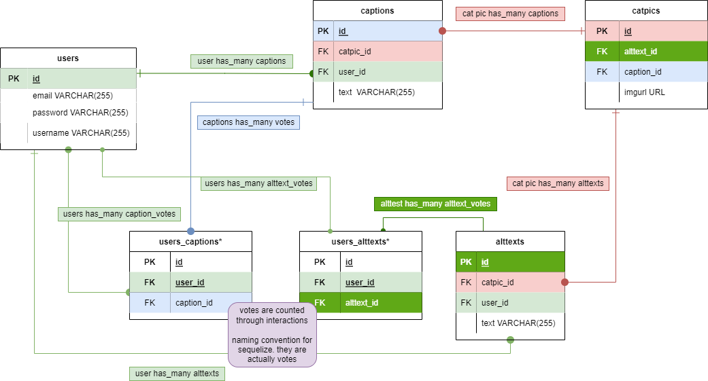

# kitty-text

## project idea/description
What type of app would encourage people to once again, give up their personal email to try out?  I was suggested a cat rating app... like Rate-My-Chonk but it made me realize that I would be making another project that would exclude those who may be visually disabled or rely on assistive technology. This is my attempt to bridge that gap.  

It still involves ratings!  But instead of images, the user will be given prompts/[alt-texts] of cat images, and they will write a caption from just the prompt. Once entered, the actual image will show and users can vote on their favorite caption.  It's madlib sort of...with pictures... i don't know. :D

Users can continue to write captions or they can go "dev-mode" and write great alt-texts for other users.  This might be a stretch goal.

Hopefully, this will be entertaining to all participants including those using screen readers.

## User stories

- As a user, I want to sign up/ sign in/ and sign out.
- As a user, I want to vote my favorite caption while logged in.
- As a user, I want to look at my previous captions signed in.
- As a user, I want to be able to write captions when signed in.
- As a user, I want to 
- As a user, 
- As a user, 
- As a user, 
## MVP
- use TheCatApi and write out 20-30 alt-texts for images
- make sure those are saved looping as prompt
- working navbar 
- random cat facts api on main page?

## stretch goals
- work on dev-mode where users can write their own alt-text from images
- make sure they are getting images without alt-texts assigned to them
- voting for best alt-texts, and they'll be used as the prompts
- dev affirmation api on "dev mode"
## installation instructions

## link to deployed live site

## ERDS

## approach taken

## tech used
- nodeJS
- javascript
- express
- ejs-layouts
- bootstrap
- dotenv
- npm
- bcrypt 
- cryptoJS
- sequelize
- postgres
- postico 
- canva.com (wireframes)
- draw.io (ERD)

## wireframes
home page-basically, i want people to know what they are signing up for

home page-the image should carousel to show how it is played

## restful routing chart

## sources used